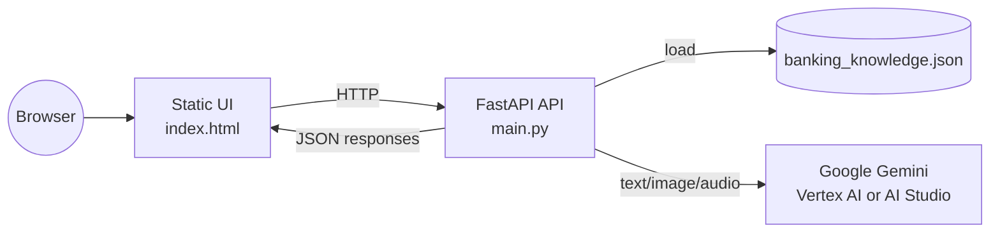
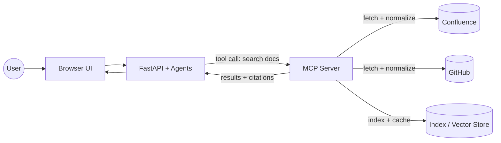

# IntelliFox — Project Overview

IntelliFox is an organizational memory engine for a banking engineering org. It serves two product experiences:
- **KT Training**: 4‑week onboarding plans with multimodal scenes (image + audio + text).
- **Knowledge Base**: grounded Q&A, system graph, and storytelling over a structured systems catalog.

The app is a **FastAPI** backend that serves a single‑page UI (`index.html`) and connects to **Google Gemini** (Vertex AI or Developer API) for text, image, and TTS generation.

## Architecture (current)

## Key components

- **main.py** — FastAPI server, agents, Gemini client, API routes.
- **index.html** — Single‑page UI with tabs for KT training, knowledge graph, and chat.
- **banking_knowledge.json** — Structured systems, teams, and process knowledge.
- **build_banking_knowledge.py** — Generates the JSON knowledge base (synthetic data).
- **Dockerfile / deploy.sh** — Cloud Run‑ready deployment.

## Core agents (backend)

- **Context Agent**: Retrieves relevant systems/teams/processes from the knowledge JSON.
- **Knowledge Graph Agent**: Builds node/edge graph for system dependencies.
- **Storytelling Agent**: Uses Gemini to produce a story + image + TTS for a topic.
- **KT Training Agent**: Generates a 4‑week onboarding plan with scenes.
- **KT Coach Agent**: Answers questions grounded in a plan digest.
- **Live Assistant Agent**: Grounded Q&A against the knowledge base.

## API surface (high level)

- `GET /` → serves `index.html`
- `GET /health` → runtime status and model/backend info
- `GET /api/systems` → summary list of systems
- `GET /api/graph` → dependency graph
- `POST /api/story` → storytelling output (text + image + audio)
- `POST /api/onboarding/generate` → KT plan generation
- `POST /api/onboarding/coach` → KT coach responses
- `POST /api/chat` → grounded assistant response
- `POST /api/chat/stream` → streaming assistant response

## Local run

1. Create a virtual env and install deps: `pip install -r requirements.txt`
2. Copy `.env.example` to `.env` and set **either** `GEMINI_API_KEY` **or** Vertex settings.
3. Run: `python main.py` (or `./run_local.sh` on macOS/Linux)

The server runs at `http://127.0.0.1:8080` by default.

## Deployment

- **Docker**: `Dockerfile` is production‑ready (non‑root, healthcheck).
- **Cloud Run**: `deploy.sh` builds and deploys to GCP.

## MCP server integration (proposed)

> **Note:** MCP integration is not implemented in this repo yet. This section describes how IntelliFox would connect to external knowledge systems in a real deployment.

### Role of an MCP server
The **Model Context Protocol (MCP)** server acts as a **connector and retrieval layer** between IntelliFox and enterprise knowledge sources (e.g., Confluence, GitHub). It normalizes content into a common schema, enforces access control, and exposes search/retrieval tools to the application.

### Real‑system flow (example)

### How it works in practice

- **Ingestion (scheduled or webhook‑driven)**  
  MCP pulls pages, PRs, issues, and repos from Confluence/GitHub, normalizes them, and stores them in an index or vector store.

- **Query time (user asks a question)**  
  IntelliFox agents call MCP tools (e.g., “search Confluence”, “list GitHub issues”) to retrieve relevant snippets with metadata and citations.

- **Grounded responses**  
  The assistant composes responses using only retrieved content, keeping answers aligned to authoritative sources.

- **Security and governance**  
  MCP handles OAuth, tenant scoping, and document‑level ACLs so IntelliFox sees only what the user is permitted to access.

### Where it fits in IntelliFox

In a production extension, the **Context Agent** and **Live Assistant Agent** would:
- Call MCP tools when internal JSON knowledge is insufficient.
- Merge internal knowledge with external citations.
- Cache frequently used artifacts for faster follow‑ups.

This keeps IntelliFox’s core UX intact while expanding its knowledge to real enterprise systems like Confluence and GitHub.
